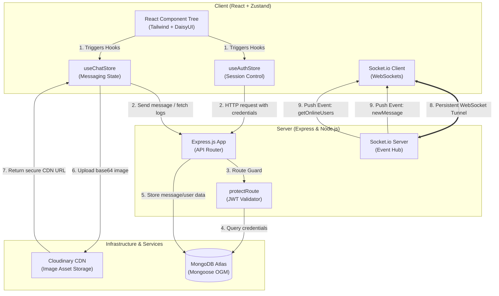

# ⚡ ChitChat: Fullstack Real-Time Chat Application

ChitChat is a production-grade, fullstack real-time chat application engineered with the **MERN** stack (**MongoDB, Express.js, React, Node.js**) and enhanced with high-performance WebSockets (**Socket.io**) for instant messaging and live online presence tracking. 

The application features a modern responsive UI supporting **32 interactive themes** (powered by TailwindCSS and DaisyUI), centralized state management using **Zustand**, and secure cloud storage integrations with **Cloudinary**.

---

## 🚀 Key Highlights & Architectural Features

*   **⚡ Bidirectional Real-Time Communication:** Persistent full-duplex WebSockets connection using **Socket.io** enables instantaneous message delivery and reactive online/offline presence tracking.
*   **🔐 Secure Session Authentication:** Multi-tier authentication pipeline using **JSON Web Tokens (JWT)** delivered in secure, tamper-proof `httpOnly` cookies, preventing XSS and CSRF vulnerabilities. Passwords are securely hashed via **bcryptjs**.
*   **📦 Decoupled Centralized State Management:** Utilizes **Zustand** stores (`useAuthStore`, `useChatStore`, `useThemeStore`) to isolate state logic from UI components, resulting in clean, performant, and prop-drilling-free architecture.
*   **🖼️ Media Optimization Pipeline:** Integration with **Cloudinary API** to support compressed, secure, and rapid base64 image message uploads and profile photo personalization.
*   **🎨 Dynamic Personalization Engine:** Out-of-the-box support for **32 responsive DaisyUI themes** with immediate persistence across reloads via synchronization with client `localStorage`.
*   **📱 Fully Responsive Layouts:** Optimized viewport styling tailored across desktop, tablet, and mobile displays.

---

## 🏗️ System Architecture & Data Flow

The diagram below highlights the integration points between the React front-end client, Node/Express api server, Mongoose data models, Socket.io events, and Cloudinary media processing.



---

## 💾 Database Schema Design

The application utilizes two primary collection schemas with relational mapping:

### User Document (`UserModel.js`)
```typescript
{
  email: { type: String, required: true, unique: true },
  fullName: { type: String, required: true },
  password: { type: String, required: true, minlength: 6 }, // Hashed using bcryptjs
  profilePic: { type: String, default: "" }, // Cloudinary Image URL
  createdAt: Date,
  updatedAt: Date
}
```

### Message Document (`MessageModel.js`)
```typescript
{
  senderId: { type: Schema.Types.ObjectId, ref: 'User', required: true },
  receiverId: { type: Schema.Types.ObjectId, ref: 'User', required: true },
  text: { type: String, trim: true },
  image: { type: String }, // Cloudinary Image CDN URL
  createdAt: Date,
  updatedAt: Date
}
```

---

## 🔌 Socket.io Event Protocol Contract

Real-time message routing and connection lifecycles are governed by the following WebSocket protocol:

| Event Name | Direction | Trigger | Payload Structure |
| :--- | :--- | :--- | :--- |
| `connection` | Client $\rightarrow$ Server | Initiated on valid JWT authentication handshake. | `{ query: { userId: string } }` |
| `getOnlineUsers` | Server $\rightarrow$ Client | Broadcast on any connection/disconnection event. | `string[]` (Array of currently online user IDs) |
| `newMessage` | Server $\rightarrow$ Client | Emitted to a recipient's socket room on new incoming message. | `{ _id: string, senderId: string, receiverId: string, text?: string, image?: string, createdAt: Date }` |
| `disconnect` | Client $\rightarrow$ Server | Fired automatically when WebSocket connection drops. | *None* |

---

## 📂 Project Structure

```bash
├── backend
│   ├── src
│   │   ├── controllers     # AuthController, MessageController core controllers
│   │   ├── lib             # DB connector, Cloudinary config, Socket.io core settings
│   │   ├── middlewares     # AuthMiddleware (JWT token validation)
│   │   ├── models          # UserModel & MessageModel Mongoose schemas
│   │   ├── routes          # Express REST endpoints
│   │   ├── Seeds           # user.seed.js script for immediate database seeding
│   │   └── index.js        # Server entry point & static React build handler
│   ├── package.json
│   └── .env.example
├── frontend
│   ├── src
│   │   ├── components      # Modular UI components (Navbar, Sidebar, ChatContainer)
│   │   ├── constants       # Static configuration, e.g., theme arrays
│   │   ├── lib             # Axios configuration instance
│   │   ├── pages           # Pages (Home, Signup, Login, Settings, Profile)
│   │   ├── store           # Zustand Global State managers (useAuthStore, etc.)
│   │   ├── App.jsx         # App router & Theme injection
│   │   ├── index.css       # Tailwind directives
│   │   └── main.jsx        # App entry point
│   ├── package.json
│   ├── tailwind.config.js
│   └── vite.config.js
└── package.json            # Monorepo scripts (build and start production servers)
```

---

## 🛠️ Getting Started & Installation

Follow these steps to configure, build, and run the project locally.

### 1. Prerequisites
Ensure you have the following installed on your machine:
*   [Node.js](https://nodejs.org/) (v18.x or higher)
*   [MongoDB Database](https://www.mongodb.com/) (Atlas URI or local server)
*   [Cloudinary Account](https://cloudinary.com/) (For photo upload configurations)

### 2. Configure Environment Variables
Navigate to the `backend/` directory, duplicate the `.env.example` file, rename it to `.env`, and populate it with your credentials:

```bash
cd backend
cp .env.example .env
```

Open `.env` and fill in the details:
```ini
PORT=5001
MONGODB_URI=your_mongodb_uri
JWT_SECRET=your_jwt_secret_key
CLOUDINARY_CLOUD_NAME=your_cloudinary_name
CLOUDINARY_API_KEY=your_cloudinary_api_key
CLOUDINARY_API_SECRET=your_cloudinary_api_secret
NODE_ENV=development
```

### 3. Install Dependencies
From the **root directory**, install dependencies for both frontend and backend directories:
```bash
npm install
```

### 4. Optional: Seed the Database
To avoid creating multiple dummy accounts manually to verify real-time chats, you can populate your database with **15 pre-seeded mockup users** (complete with random profiles, avatars, and email logs):
```bash
cd backend
node src/Seeds/user.seed.js
```
*(All seeded users are pre-configured with the default password: `123456`)*

### 5. Running the Application in Development Mode
Run both backend and frontend development environments simultaneously using their respective scripts:

**Run the Backend Server:**
```bash
cd backend
npm run dev
```
*Backend runs on `http://localhost:5001` (Socket server listening).*

**Run the Frontend Client:**
```bash
cd frontend
npm run dev
```
*Vite web client spins up on `http://localhost:5173`.*

---

## ⚡ Production Deployment

For optimized, single-instance production execution, the Express backend serves static React production assets:

1.  Compile frontend components and verify dependencies:
    ```bash
    npm run build
    ```
2.  Start the unified cluster:
    ```bash
    npm run start
    ```

---

## 💡 Key Design Decisions & Decoupling

*   **Zustand vs Redux:** Choosing **Zustand** allowed for custom hooks that are clean, easy to test, and highly composable. It avoids Redux's heavy boilerplate, reducing overhead while offering an atomic state subscription system that ensures only modified components re-render.
*   **Dual-Tier Architecture with Serve Static:** Serving compiled client-side assets from Node.js in production decreases networking overhead, cuts costs by using a single hosted server instance (e.g., on Render or Heroku), and prevents CORS conflicts out-of-the-box.
*   **HttpOnly Cookies for JWT:** Storing JWT inside client-side local storage leaves the app vulnerable to XSS token theft. Using `httpOnly` secure cookies ensures tokens are invisible to browser scripts, providing industry-standard security.
